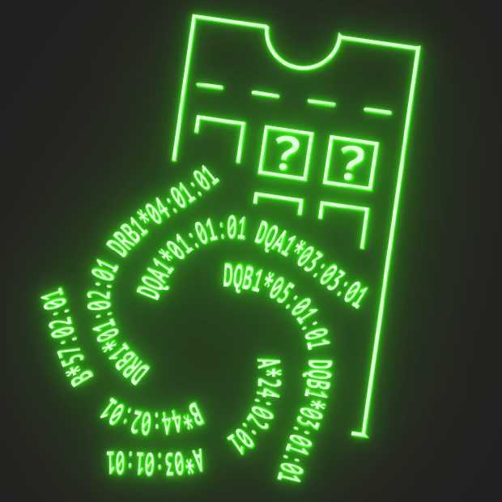

# Example usage with test data


##### Build and install scrHLAtag
```sh
loc=~/develop/scrHLAtag # or location where you have cloned the repository
cd $loc
cargo build --release && cp target/release/scrHLAtag ~/.local/bin
```

#### Run on small dataset
```sh
loc=~/develop/scrHLAtag
scrHLAtag -v -b $loc/data/test.bam -a $loc/data/testhla.tsv -o out -l transcriptome -s
```

#### Run on larger dataset
```sh
loc=~/develop/scrHLAtag
scrHLAtag -v -b $loc/data/full_dedup.bam -a $loc/data/testhla.tsv -o out
```


## Thank you for trying out scrHLAtag!

