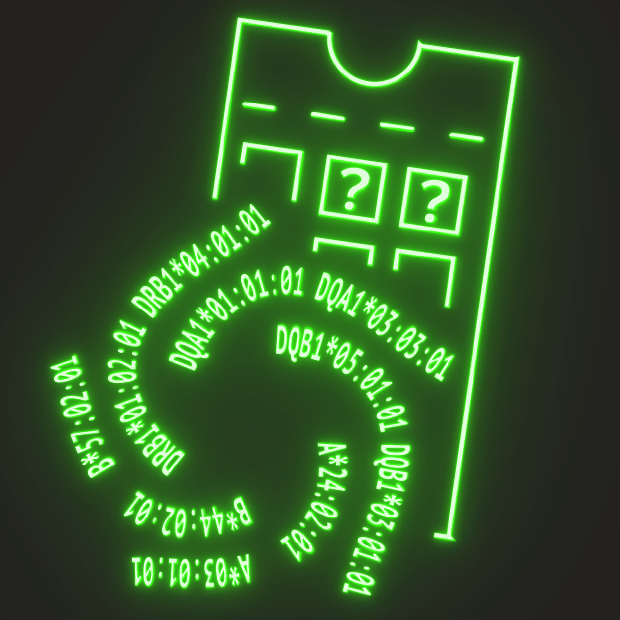

#                       scrHLAtag
Pipeline for processing scrHLA typing data


### Overview

scrHLAtag is a command line tool written in Rust for processing long-read (PacBio) sequencing data generated from 10X Genomics libraries.  Using scrHLAtag, you can supply relevant HLA alleles, and obtain a counts file of the number of reads that map to your HLA query and their associated cell-barcodes and umis.  scrHLAtag takes as input a BAM file that has been processed using the single cell IsoSeq3 pipeline through the dedup stage.

### Installation

scrHLAtag is written in Rust.  To install the rust compiler go to https://www.rust-lang.org/tools/install.  scrHLAtag requires two additional tools be available on the command line, minimap2 (https://github.com/lh3/minimap2) and samtools (https://samtools.github.io). 

To install scrHLAtag:
1. clone the repository by typing `https://github.com/furlan-lab/scrHLAtag.git` from the location you want to build from
2. enter the cloned repo by typing `cd scrHLAtag`
3. build by typing `cargo build release`
4. the build process will create a self contained binary executable file in targets/release directory called `scrHLAtag`
5. move this binary elsewhere if desired (ideally somewhere referenced by your PATH environment variable - e.g. `~/.local/bin`)

### Usage

##### Invocation.

First users will generate a simple 'alleles_file' that lists the HLA alleles to be counted (txt.file). The names of the alleles should be taken from the Anthony Nolan registry (https://www.ebi.ac.uk/ipd/imgt/hla/).  The alleles_file should look something like this:

```sh
A*30:02:01:01
A*24:02:01:01
B*57:02:01:01
B*48:01:01:01
C*18:02:01:01
C*08:06
DRB1*03:02:01:01
DRB1*04:01:01:01
DRB3*01:62:01:01
DQB1*04:02:01:01
```
Note: the hla reference file (from Nolan registry) is included in this program and does not need to be supplied during invocation.  Current version: 3.50.  Additionally, because the `*` character is not fasta friendly, the `|` character is used instead as a separator.  The alleles_file should still contain * however,=.

To run scrHLAtag simply type:

`scHLAtag -b BAMFILE -a ALLELES_FILE -o OUTFOLDER`


##### Help menu

```sh
scrHLAtag 0.1
scfurl
count reads bam files per cb and umi for scrHLA typing

USAGE:
    scrHLAtag [FLAGS] [OPTIONS] --bam <bam>

FLAGS:
    -h, --help       Prints help information
    -V, --version    Prints version information
    -v, --verbose    verbose

OPTIONS:
    -a, --hlaalleles <alleles>    table of hla genes to search for (tsv)
    -b, --bam <bam>               input bam
    -c <cb>                       character to parse cell barcode; default = 'CB='
    -g, --genome <genome>         reference genome
    -o, --out <outfile>           folder for output; default out
    -t, --threads <threads>       threads
    -u <umi>                      character to parse umi; default = 'XM='
```
 
### Output
 
scrHLAtag will output the following files:
```sh
Aligned_mm2_sorted.bam          = minimap2 output bam file, sorted by readname
Aligned_mm2_sorted.bam.bai      = index for above bam
counts.txt.gz                   = counts file; columns: CB, UMI, allele, read_count
align.fa                        = fasta reference file used for minimap2 alignment
molecules_info.txt.gz           = a file withing alignment metrics for each molecule; columns: CB, UMI, allele, start_pos, mapq, cigar, NM, AS, s1, de)
```
See minimap2 manual for a discussion of the molecule_info metrics